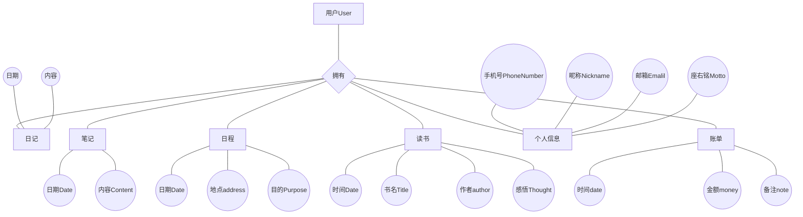
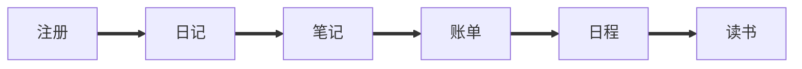

# Personnel-Records

### 注册 

## 流程

## SQL 存储过程
### 用户部分
- [x] 用户注册 
- [x] 用户更改密码
- [x] 登陆
### 日记部分
- [x] 日记添加
- [x] 日记查询
- [ ] 日记修改
- [ ] 日记删除
### 笔记部分
- [ ] 笔记添加
- [ ] 笔记查询
- [ ] 笔记修改
- [ ] 笔记删除
### 账单部分
- [ ] 账单添加
- [ ] 账单查询
- [ ] 账单修改
- [ ] 账单删除
- [ ] 账单总和
- [ ] 账单月总和
### 日程部分
- [ ] 日程添加
- [ ] 日程查询
- [ ] 日程修改
- [ ] 日程删除
### 读书部分
- [ ] 读书添加
- [ ] 读书修改
- [ ] 读书查询
- [ ] 读书删除

### 综合部分
- [ ] 时间线数据返回
- [ ] 综合搜索
- [ ] 用户登陆查询
- [ ] 用户登陆后展示对应信息

## 后端

- [ ]将数据生成JSON 

## 页面
### 类似于teambition界面样式侧边栏(左侧) 用户时间线(右侧)
使用jquery UI组建库
- [ ] 登陆
- [ ] 注册
- [ ] 修改密码
- [ ] 用户主界面(设置为已经添加的日程)
- [ ] 时间线